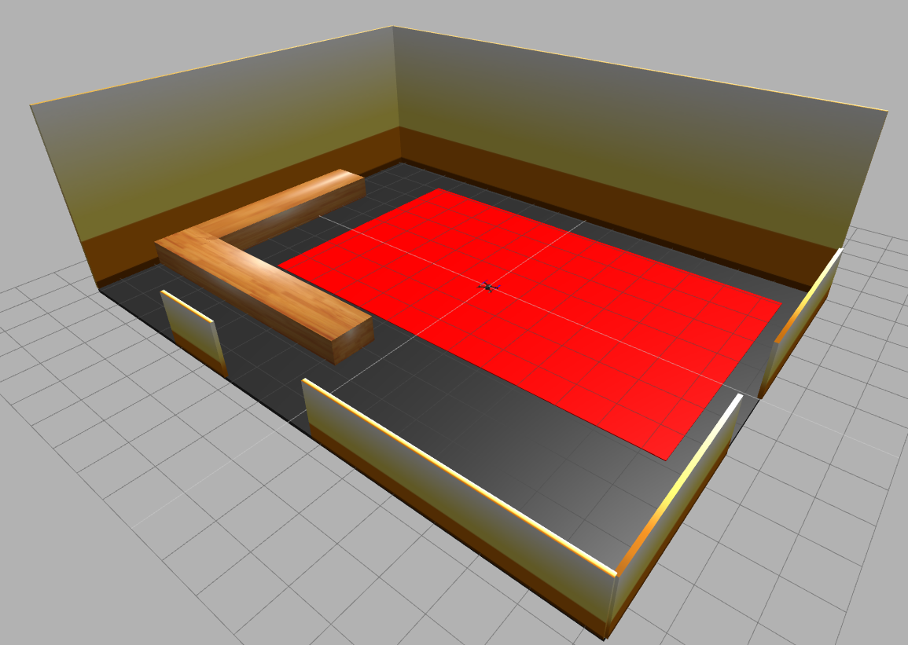

# Flight Arena Gazebo in Starling

This repository contains a simple gazebo model of the flight arena within a docker-container for use with the Starling eco-system. This example currently ships with a PX4 based SITL by default.



## Shape

Flight arena is 15.6m x 11.8m x 5m (x, y, z) tall.

```
_________________________________
|                                |
|                                |
|                                |
|_                              L|
|C|
|  |                             |
|__|____________                 |
|___|_V_|___|___|                |
|                     _____ _____|
|_    _____    ______|__E__|_____|
```


The coordinate space is x positive is up and y postivie is left (w.r.t the ascii figure).

The flight arena origin is offset by (0.5, 0.7, 0.0) from the center of the space. This coincides with the vicon center

## Features

### Static Gimbal Model

By default, the container will load up a controllable static gimbal.

### Vision Position Tracking

The `motion_tracker_sim` ros node has been developed to mimic the VICON motion tracking system we have at the arena. It reads the gazebo local entity positions through the `model_states` topic.

It first filters entity names by the `MOTION_TRACKER_ENTITY_PREFIX_LIST` environment variable which is a space seperated list of entity prefix names. By default this is set to `"iris gimbal rover"`. It is assumed that wanted entity names have a name of format `<prefix>_<id>` where the `id` is unique across all vehicles.

It then queries for the current list of topics to find the current list of active vehicles. It looks for namespaces which have a mavros subnamespace. Namespaces are assumed to be of form `<ANYTHING>_<id>`. Again the `id` is assumed unique. An entity id matches a vehicle id if the id's are the same. The entity's pose is then forwarded over `/<vehicle_id>/mavros/vision_pose/pose` by default.

Note that the simulator SITL sensor fuser needs to be able to process inputs from external vision on this topic. For PX4 this involves setting `EKF2_HGT_MODE` to 3 and `EKF2_AID_MASK` to 24 (EV_POS+EV_YAW). As of writing this can be achieved by setting the `ENABLE_EXTERNAL_VISION` env var for the `px4-sitl` container.

## Usage

### Local Docker

Build and run the associated world and element into a container by running the following
```sh
make run

# just running `make` will build but not run it
```

The Gazebo web interface is then available on [localhost:8080](http://localhost:8080).

On Linux, any MAVLink compatible GCS can be connected to UDP 14550. Many GCS will do this automatically.

On Windows, any MAVLink compatible GCS can be connected to TCP 5761.

If you wish to run with additional drone, then you can use the associated docker-compose file

```sh
make
docker-compose up
```

The docker-compose file also includes the UI which you can run to double check the image output of the gimbal. Accessible via `localhost:3000`

To check the ROS network, you can either `docker exec -it <containerhash> bash` into the container, or you can run `make run_bash` which will put you in a shell on the same network. Then to access the ros2 topics:
```
source /opt/ros/foxy/setup.bash
ros2 topic list
```

### Running with Murmuration

This container can be easily run with the Murmuration `starling` cli.

First build and run the associated world and element into a container by locally running
```sh
make
```

Then start the starling instance as usual, e.g.
```sh
starling start kind # one drone
# or
starling start kind -n 2 # two drones
```

Then startup and load all of the simulation files. You can specify the simulator and sitl launch files, and load them in locally.
```sh
starling simulator start --simulator_kube_deployment_yaml k8.gazebo-brl.yaml --sitl_kube_deployment_yaml k8.px4-sitl.yaml --load
```

This command uses options to point to the local variants of the simulator and sitl launch files. These launch files contain the following differences:
1. The simulator uses the container with the BRL Environment. This includes the motion tracker node.
2. The SITL contains an option which enables vision position tracking using the motion tracker node, and disables GPS. This emulates the VICON setup at the BRL (Note you may need to build the `pr-reduce-container-size` px4-sitl container).


### Troubleshooting

The simulator needs to download some model files when it is first run so it will likely fail to spawn the vehicle.
Leave it running for a few minutes then use `Ctrl+C` to exit and run it again. This should allow the model to spawn.
The first time the model attempts to spawn, the simulator will need to download files for it too so it may be slow to
start. Subsequent runs should be much faster.

When running the docker-compose, it will create a docker network called `BRLFightlArenaGazebo_default` which any additional calls to `docker run` can use.

## Files

### Flight Arena world file and models

The BRL world file is in the `flightarena` folder. The elements within the flight arena are all hard coded boxes.

> Note: need to find a way to apply texture

### 3D Gimbal on tripod

The gimbal is split into 3 parts.

1. The gimbal model which is located in `systems/models/gimbal_small_2d`
2. The gimbal plugin i.e. the gimbal controller in `systems/gimbal_plugin`
3. The gimbal tripod with camera which is located in `systems/models/gimbal_tripod`

Any changes made to any folder can be rebuilt when run `make`

## Developing your own ROS2 controller

An example offboard ROS2 controller can then be conncted to SITL by running the following in a separate terminal:

```
# Download the latest container
docker pull uobflightlabstarling/example_controller_python

docker run -it --rm --network fenswoodscenario_default uobflightlabstarling/example_controller_python
```

See [the docs](https://docs.starlinguas.dev/guide/single-drone-local-machine/#2-running-example-ros2-offboard-controller-node) for further details
